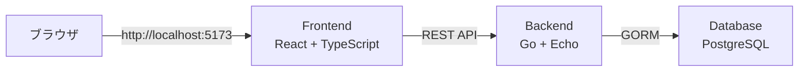

# メモアプリ完成レポート

## 🎉 実装完了

React + Go + PostgreSQLを使用したメモアプリケーションが完成しました！

---

## ✨ 実装された機能

### 1. メモのCRUD操作
- ✅ **作成**: 右側のフォームでタイトルと内容を入力して作成
- ✅ **読み取り**: 左側のリストに全メモを表示
- ✅ **更新**: メモをクリックして右側で編集
- ✅ **削除**: カスタム確認ダイアログ付きで削除

### 2. ドラッグ&ドロップ並び替え
- ✅ メモをドラッグして順序を変更可能
- ✅ ドラッグ中は背景色が変わって視覚的フィードバック

### 3. メモ選択と編集
- ✅ 左側のメモをクリックすると右側に内容が表示
- ✅ 選択されたメモは青い枠線でハイライト
- ✅ 編集モードでは「Update Memo」ボタンと「Cancel」ボタンを表示

### 4. カスタム確認ダイアログ
- ✅ 削除時にReactベースのモーダルダイアログを表示
- ✅ 「削除」と「キャンセル」ボタン
- ✅ 日本語メッセージ

### 5. レスポンシブレイアウト
- ✅ 2カラムレイアウト（左: メモ一覧、右: フォーム）
- ✅ メモ一覧は固定幅300px
- ✅ フォームは残りのスペースを使用

---

## 🏗️ アーキテクチャ



### 技術スタック

#### フロントエンド
- **React 18** + TypeScript
- **Vite** (ビルドツール)
- **Axios** (HTTPクライアント)
- **OpenAPI Generator** (型安全なAPIクライアント生成)

#### バックエンド
- **Go 1.23**
- **Echo v4** (Webフレームワーク)
- **GORM** (ORM)
- **PostgreSQL Driver** (pgx)

#### インフラ
- **Docker Compose** (オーケストレーション)
- **PostgreSQL 15** (データベース)

---

## 📁 主要ファイル

### フロントエンド
- [App.tsx](file:///wsl.localhost/Ubuntu/home/kouhei/go/github.com/pnir0001/test_antigravity/frontend/src/App.tsx) - メインアプリケーション、2カラムレイアウト
- [MemoList.tsx](file:///wsl.localhost/Ubuntu/home/kouhei/go/github.com/pnir0001/test_antigravity/frontend/src/components/MemoList.tsx) - メモ一覧、ドラッグ&ドロップ、カスタムダイアログ
- [MemoForm.tsx](file:///wsl.localhost/Ubuntu/home/kouhei/go/github.com/pnir0001/test_antigravity/frontend/src/components/MemoForm.tsx) - メモ作成/編集フォーム
- [client.ts](file:///wsl.localhost/Ubuntu/home/kouhei/go/github.com/pnir0001/test_antigravity/frontend/src/api/client.ts) - APIクライアント設定

### バックエンド
- [main.go](file:///wsl.localhost/Ubuntu/home/kouhei/go/github.com/pnir0001/test_antigravity/backend/main.go) - エントリーポイント
- [handlers.go](file:///wsl.localhost/Ubuntu/home/kouhei/go/github.com/pnir0001/test_antigravity/backend/handlers/handlers.go) - CRUD APIハンドラー
- [memo.go](file:///wsl.localhost/Ubuntu/home/kouhei/go/github.com/pnir0001/test_antigravity/backend/models/memo.go) - GORMモデル
- [db.go](file:///wsl.localhost/Ubuntu/home/kouhei/go/github.com/pnir0001/test_antigravity/backend/db/db.go) - DB接続、リトライロジック

### 設定
- [openapi.yaml](file:///wsl.localhost/Ubuntu/home/kouhei/go/github.com/pnir0001/test_antigravity/openapi.yaml) - API仕様
- [docker-compose.yaml](file:///wsl.localhost/Ubuntu/home/kouhei/go/github.com/pnir0001/test_antigravity/docker-compose.yaml) - サービス定義
- [Makefile](file:///wsl.localhost/Ubuntu/home/kouhei/go/github.com/pnir0001/test_antigravity/Makefile) - OpenAPIクライアント生成

---

## 🚀 使い方

### 起動
```bash
cd /home/kouhei/go/github.com/pnir0001/test_antigravity
docker-compose up -d
```

### アクセス
- **フロントエンド**: http://localhost:5173
- **バックエンドAPI**: http://localhost:8080/api/v1

### 停止
```bash
docker-compose down
```

### ログ確認
```bash
docker-compose logs -f backend
docker-compose logs -f frontend
```

---

## 🎨 UI/UX の工夫

### レイアウト
- 左側にメモ一覧（幅300px固定）
- 右側にメモ作成/編集フォーム（残りスペース）
- 全体を左寄せで統一

### インタラクション
- メモクリックで選択・編集
- 選択中のメモは青い枠線でハイライト
- ドラッグ中は背景色変更
- カスタムモーダルダイアログで削除確認

### 日本語対応
- 確認ダイアログ: 「このメモを削除してもよろしいですか？」
- ボタン: 「削除」「キャンセル」
- エラーメッセージ: 「削除に失敗しました」

---

## 🔧 解決した課題

### 1. データベース接続タイミング
**問題**: バックエンドがDBより先に起動してエラー  
**解決**: 指数バックオフ付きリトライロジック実装

### 2. タイムゾーンエラー
**問題**: Alpine LinuxでAsia/Tokyoが未サポート  
**解決**: タイムゾーンをUTCに変更

### 3. フロントエンド表示問題
**問題**: APIレスポンスがnullでエラー  
**解決**: `response.data || []` でnullチェック

### 4. インポートエラー
**問題**: `Configuration`が`./api`からインポートできない  
**解決**: `./index`からインポートするように修正

### 5. 入力ボックスのはみ出し
**問題**: inputとtextareaが枠からはみ出す  
**解決**: `boxSizing: 'border-box'` を追加

### 6. 確認ダイアログがブロック
**問題**: `window.confirm()`が表示されない  
**解決**: Reactベースのカスタムモーダルダイアログを実装

---

## 📊 API エンドポイント

| メソッド | パス | 説明 |
|---------|------|------|
| GET | `/api/v1/memos` | メモ一覧取得 |
| POST | `/api/v1/memos` | メモ作成 |
| GET | `/api/v1/memos/{id}` | メモ詳細取得 |
| PUT | `/api/v1/memos/{id}` | メモ更新 |
| DELETE | `/api/v1/memos/{id}` | メモ削除 |

---

## ✅ 完成した機能一覧

- [x] OpenAPI仕様の作成
- [x] バックエンドAPI実装
- [x] フロントエンド実装
- [x] Docker Compose環境構築
- [x] メモのCRUD操作
- [x] ドラッグ&ドロップ並び替え
- [x] メモ選択と編集機能
- [x] カスタム確認ダイアログ
- [x] 2カラムレイアウト
- [x] 日本語対応
- [x] エラーハンドリング

---

## 🎉 まとめ

完全に動作するメモアプリケーションが完成しました！

**主な特徴:**
- スキーマ駆動開発（OpenAPI）
- 型安全なフロントエンド（TypeScript）
- Docker Composeによる簡単な起動
- 直感的なUI/UX
- 日本語対応

お疲れ様でした！
