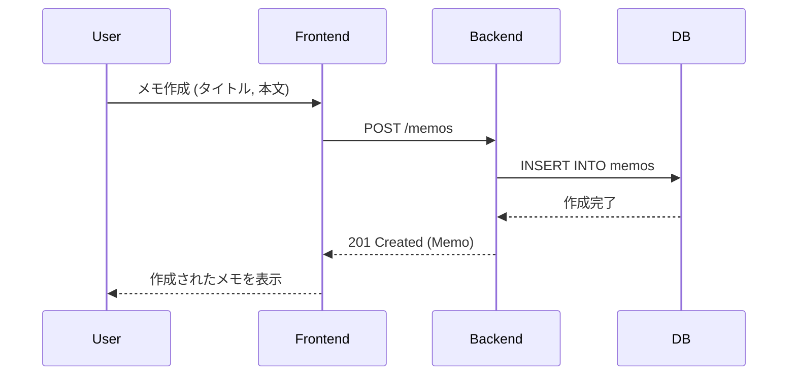

# メモアプリ実装計画

## 目標
作成、読み取り、更新、削除（CRUD）機能を備えたテキストメモアプリケーションを作成します。
アーキテクチャ：
- フロントエンド：React
- バックエンド：Go
- データベース：PostgreSQL
- インフラ：Docker Compose（オーケストレーション用）

手法：OpenAPIを使用したスキーマ駆動開発（SDD）。

## シーケンス図

## ユーザーレビュー必須事項
- OpenAPI仕様書の確認（作成予定）。
- Docker Composeのサービス名とポートの確認。

## 提案される変更

### API設計
#### [NEW] [openapi.yaml](file:///wsl.localhost/Ubuntu/home/kouhei/go/github.com/pnir0001/test_antigravity/openapi.yaml)
- `Memo`スキーマの定義（id, title, content, created_at, updated_at）。
- エンドポイントの定義：
    - `GET /memos`: メモ一覧取得
    - `POST /memos`: メモ作成
    - `GET /memos/{id}`: メモ詳細取得
    - `PUT /memos/{id}`: メモ更新
    - `DELETE /memos/{id}`: メモ削除

### インフラ
#### [NEW] [docker-compose.yaml](file:///wsl.localhost/Ubuntu/home/kouhei/go/github.com/pnir0001/test_antigravity/docker-compose.yaml)
- サービス：`frontend`, `backend`, `db`。

### バックエンド (Go)
- ディレクトリ：`backend/`
- フレームワーク：`gin`
- `openapi-generator`を使用してボイラープレートを生成。
- DB操作には`gorm`を使用。

### フロントエンド (React)
- ディレクトリ：`frontend/`
- `vite`を使用してスキャフォールディング。
- API操作には生成されたクライアントを使用。

## 検証計画
### 自動テスト
- `docker-compose up`を実行し、サービスの健全性を確認。
- APIに対するCurlテスト。

### 手動検証
- localhostを開き、React UIを確認。
- UIを介してCRUD操作を実行。
