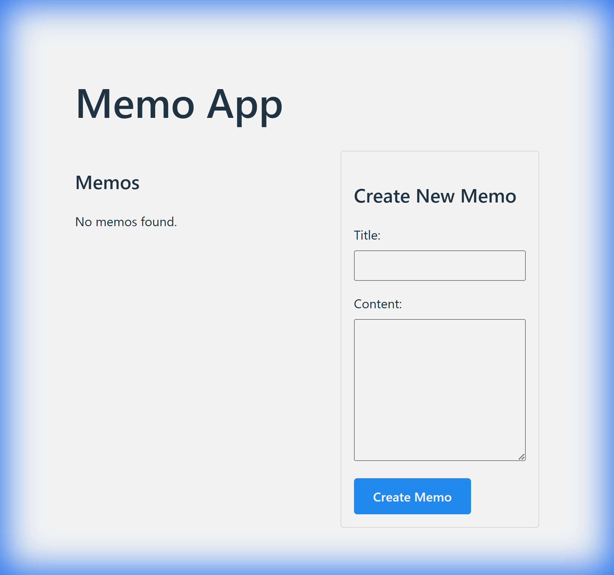

# Test Antigravity

Antigravityの機能検証用メモアプリケーションです。
React + Go + PostgreSQLを使用し、モダンなWebアプリケーション開発のベストプラクティスを実装しています。



## ✨ 特徴

- **メモのCRUD操作**: 作成、読み取り、更新、削除
- **ドラッグ&ドロップ**: メモの並び替えが可能
- **レスポンシブUI**: 2カラムレイアウト（一覧 + 編集フォーム）
- **カスタムダイアログ**: 削除時の確認モーダル
- **日本語対応**: UIおよびメッセージの完全日本語化

## 🛠 技術スタック

### フロントエンド
- **React 18** + TypeScript
- **Vite**
- **Axios** + OpenAPI Generator

### バックエンド
- **Go 1.23**
- **Echo v4**
- **GORM** + PostgreSQL Driver

### インフラ
- **Docker Compose**
- **PostgreSQL 15**

## 🚀 使い方

### 起動

```bash
docker-compose up -d
```

### アクセス

- **フロントエンド**: http://localhost:5173
- **バックエンドAPI**: http://localhost:8080/api/v1

### 停止

```bash
docker-compose down
```

## 📁 ディレクトリ構成

- `.antigravity/`: プロジェクト管理・ドキュメント
- `backend/`: Go APIサーバー
- `frontend/`: Reactアプリケーション
- `openapi.yaml`: API定義書
